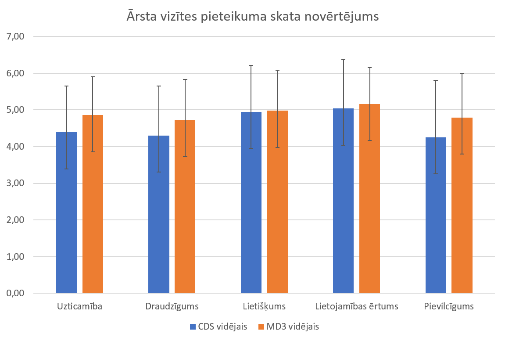

# CDS vs MD3 lietotāju aptaujas rezultāti

Repozitorijs satur lietotāju aptaujas rezultātus no bakalaura darba "Material Design 3 dizaina sistēmas izvērtēšana un integrācija LX/UI komponenšu bibliotēkā", kurā tika salīdzināta LX/UI komponenšu bibliotēkas esošā Carbon Design System (CDS) balstītā tēma ar alternatīvu, uz Material Design 3 (MD3) principiem balstītu tēmu. Zemāk atrodama īsa darba konteksta izklāsts, aptaujas metodika un rezultāti.

## Par darbu

Bakalaura darba ietvaros LX/UI Vue.js komponenšu bibliotēkai, kuras esošais noformējums balstās uz Carbon Design System, tika izstrādāta alternatīva globālā tēma, balstoties uz Material Design 3 (MD3) principiem. Lai novērtētu, kā lietotāji uztver abas tēmas (CDS un MD3), tika veikta aptauja - tās metodika un rezultāti apkopoti zemāk.

## Kā tika veidota aptauja

Lai empīriski novērtētu hipotēzi, tika veikta anonīma lietotāju aptauja, kurā piedalījās 102 dažāda vecuma un dzimuma respondenti. Aptauja sastāvēja no 10 skatu attēliem, kas veidoja 5 pārus. Katrā pārī viens skats tika izstrādāts, izmantojot LX/UI bibliotēkas komponentes un rīkus, pārstāvot CDS balstītu pieeju, savukārt otrs tika veidots, balstoties uz MD3 principiem, izmantojot Figma prototipēšanas rīku. Lai mazinātu krāsu kā mainīgā ietekmi uz rezultātiem, abos variantos tika izmantota identiska krāsu palete. Tādējādi salīdzinājums fokusējas uz formu, tipogrāfiju un izkārtojumu, nevis uz atšķirībām krāsu izvēlē starp abiem dizaina variantiem.

Katru skatu respondenti novērtēja pēc pieciem apgalvojumiem, kas atspoguļoja uzticamības, draudzīguma, lietišķuma, lietojamības ērtuma un pievilcīguma kritērijus:

1. Šis skats man šķiet uzticams (tam varētu uzticēt personas datus, maksājuma vai citu sensitīvu informāciju).
2. Šis skats man šķiet draudzīgs (tas rada pieejamu un labvēlīgu iespaidu).
3. Šis skats man šķiet lietišķs (tas šķiet oficiāls, nopietns, vērsts uz uzdevumu izpildi).
4. Šo skatu man būtu ērti lietot (informācija šķiet viegli uztverama un pārskatāma, nepieciešamās darbības varētu veikt bez papildu palīdzības).
5. Šis skats man patīk.

Skatiem tika izvēlēti pieci dažādi lietošanas konteksti - ārsta vizītes pieteikuma forma, bankas sākuma panelis, reģistrācijas forma, uzņēmuma pasūtījumu saraksts un e-komercijas produkta skats. Izvēlētie skati pārstāv piecus atšķirīgus lietošanas kontekstus - sensitīvu, sabiedrībai paredzētu pakalpojumu, augsta riska finansiālu vidi, universālu, neitrālu vidi, uz uzdevumu orientētu darba vidi un komerciālu, uz patērētāju vērstu vidi.

Skatu pāri netika rādīti secīgi, t.i., CDS un MD3 varianti netika rādīti viens aiz otra. Skatu secība tika sakārtota nejaušā secībā pirms aptaujas izplatīšanas, lai mazinātu "secības efektu" (order effect), kurā respondents sāk tieši salīdzināt divus skatus un vērtē tos relatīvi viens pret otru, nevis katru neatkarīgi. Šis efekts var ietekmēt rezultātus, tādēļ jautājumu un stimulu secības sakārtošana nejaušā kārtībā aptaujās tiek plaši ieteikta kā metode šī riska mazināšanai.

Skatu secība bija šāda:

1. CDS ārsta vizītes pieteikuma skats,
2. MD3 bankas sākuma paneļa skats,
3. MD3 reģistrācijas skats,
4. CDS bankas sākuma paneļa skats,
5. MD3 pasūtījumu saraksta skats,
6. CDS e-komercijas produkta skats,
7. CDS pasūtījumu saraksta skats,
8. MD3 ārsta vizītes pieteikuma skats,
9. CDS reģistrācijas skats,
10. MD3 e-komercijas produkta skats.

Aptaujā tika izmantota 6 punktu Likerta skala no 1 ("pilnībā nepiekrītu") līdz 6 ("pilnībā piekrītu"). Neitrālā atbildes kategorija netika iekļauta, lai mazinātu satisficing efektu - respondentu tendenci izvēlēties kognitīvi vienkāršāko atbildi, nevis rūpīgi izvērtēt katru apgalvojumu.

---

## Aptaujas rezultāti

**Ārsta vizītes pieteikuma skata novērtējums**

Ārsta vizītes pieteikuma skatā MD3 variants saņēma augstākus vērtējumus visos piecos kritērijos. Izteiktākā atšķirība bija pievilcīguma kritērijā (CDS - 4,25; MD3 - 4,79) un draudzīguma kritērijā (4,30 pret 4,73). Standartnovirze MD3 variantam visos kritērijos bija mazāka, kas liecina par lielāku vienprātību respondentu vidū. Šie rezultāti saskan ar aprakstīto, ka noapaļotas formas un vizuāli draudzīgāks noformējums tiek uztverts kā pieejamāks pakalpojumu orientētā kontekstā.

Brīvā teksta komentāros CDS variants tika vērtēts pretrunīgi - daļa respondentu to uztvēra kā lakonisku un pārskatāmu, citi norādīja uz pārāk minimālistisku izskatu un sīku šriftu. MD3 variantam tika izcelta vieglāka aizpildāmība un lielāki elementi.

---

**Bankas sākuma paneļa skata novērtējums**

`[attēls]`

Bankas konta pārskata skatā CDS saņēma augstākus vērtējumus visos kritērijos. Izteiktākā atšķirība bija lietišķuma (CDS - 4,38; MD3 - 3,71), pievilcīguma (4,50 pret 3,95) un uzticamības kritērijā (4,57 pret 4,13). Standartnovirze MD3 variantam šajā skatā bija lielāka gandrīz visos kritērijos, kas norāda uz lielāku viedokļu izkliedi. Strukturēts, leņķisks noformējums augstas atbildības vidē var stiprināt uztverto uzticamību un profesionalitāti, kas atbilst aplūkotajiem pētījumiem par formu un uzticamības saistību.

Brīvā teksta komentāros vairāki respondenti norādīja, ka MD3 varianta noapaļotās formas un vizuāli uzkrītošais un biezais izdevumu grafiks liek skatam izskatīties mazāk nopietnam un nepiemērotam finanšu kontekstam. CDS variants tika vērtēts kā pārskatāmāks un skaidrāks.

---

**Reģistrācijas skata novērtējums**

`[attēls]`

Reģistrācijas skata vērtējumi bija vistuvākie visā aptaujā. Lietojamības ērtuma kritērijā CDS ieguva nedaudz zemāku vērtējumu (CDS - 5,00; MD3 - 5,29), pārējos kritērijos atšķirības bija nelielas. Reģistrācijas skats ir kontekstuāli neitrāls elements, kas parādās gandrīz jebkurā sistēmā neatkarīgi no tās rakstura, kas varētu būt iemesls, kādēļ dizaina sistēmas vizuālā ietekme šeit izrādījās vismazākā.

Brīvā teksta komentāros vairums komentāru attiecās nevis uz vizuālo noformējumu, bet gan uz pieprasītās informācijas apjomu. Piemēram, vairāki respondenti norādīja, ka obligātais dzimšanas datu un dzimuma lauks raisīja neuzticību. Vizuālā aspektā viens respondents atzīmēja, ka krāsu palete šķiet "silta un draudzīga".

---

**Uzņēmuma pasūtījumu saraksta skata novērtējums**

`[attēls]`

Pasūtījumu saraksta skatā CDS vērtējumi visos kritērijos bija augstāki vai līdzvērtīgi MD3 variantam. Izteiktākā atšķirība bija pievilcīguma dimensijā (CDS - 4,52; MD3 - 4,31). Tāpat kā bankas skatā, respondenti CDS uztvēra kā piemērotāku darbam vērstā, strukturētā vidē, kur nepieciešama koncentrēšanās uz informācijas analīzi. Tas saskan ar aprakstīto, ka leņķiskas formas varētu veicināt paaugstinātu uzmanību un koncentrēšanos uz detaļām.

Brīvā teksta komentāros vairāki respondenti norādīja, ka MD3 variants vizuāli saplūst - galvenes rinda esot grūti atšķirt no datu rindām, kā arī informācija kopumā šķiet grūti pārskatāma.

---

**E-komercijas produkta skata novērtējums**

`[attēls]`

E-komercijas produkta skata vērtējumi bija jauktāki. MD3 ieguva augstākus vērtējumus uzticamības (4,40 pret 4,29), draudzīguma (4,64 pret 4,40) un pievilcīguma (4,54 pret 4,35) kritērijos, savukārt CDS ieguva augstāku vērtējumu lietišķuma kritērijā (4,76 pret 4,48). Tas liecina, ka izvēlētā dizaina sistēma var tikt apzināti izmantota, lai ietekmētu produkta uztverto tēlu atbilstoši vēlamajam raksturam.

Brīvā teksta komentāros CDS variants vairākkārt tika raksturots kā pārāk "nopietns" un mazāk piemērots e-komercijas kontekstam, lai gan daži respondenti novērtēja tā pārskatāmību un lietišķo novērtējumu. MD3 variants tika uztverts kā vizuāli draudzīgāks, kas saskan ar kvantitatīvajiem vērtējumiem. Viens respondents skaidri formulēja asociāciju, ka noapaļoti stūri šķiet draudzīgāki un mazāk formāli, savukārt leņķiski stūri raisa asociācijas ar lietišķumu un nopietnību, kas veiksmīgi ilustrē formu un uztveres saistību.

---

**Visu skatu kopējais novērtējums**

`[attēls]`

Aplūkojot kopējos vidējos rādītājus visiem skatiem, abas dizaina sistēmas uzrāda ļoti līdzīgus rezultātus. Tas liecina, ka dizaina sistēmas izvēle pati par sevi ne vienmēr kritiski ietekmē lietotāja pieredzi. Neskatoties uz to, konteksts ietekmēja vērtējumu sadalījumu - MD3 tika uztverts kā vizuāli draudzīgāks un pievilcīgāks lietotājam vērstos kontekstos, savukārt CDS tika vērtēts augstāk formālās, riska piesātinātās vidēs. Šie rezultāti ir izmantojami ne tikai dizaina sistēmu izvēlē, bet arī kā instruments produkta uztverto tēlu pielāgošanai konkrētai mērķauditorijai un lietojamības optimizēšanā.

---

## Ierobežojumi

Aplūkojot respondentu komentāru kopumā, redzams, ka daļa respondentu vērtēja skatus pēc kritērijiem, kas nav tieši saistīti ar dizaina sistēmas izvēli. Piemēram, ārsta vizītes pieteikuma skatā vairāki respondenti norādīja, ka neredz vietnes URL vai iestādes logotipu, kas mazina uzticamību, vai arī komentēja navigācijas elementu trūkumu. Pasūtījumu saraksta skatā izskanēja piezīmes par filtrēšanas iespēju nepietiekamību un kontaktinformācijas trūkumu. Reģistrācijas skatā respondenti bieži komentēja pieprasītās informācijas apjomu un formas struktūru. Šie visi ir satura un funkcionālie lēmumi, nevis ar dizaina sistēmu saistīti jautājumi.

Vienlaikus jāatzīmē, ka dažos komentāros izskanēja piezīmes par krāsu paleti. Piemēram, e-komercijas skats vairākiem respondentiem šķita pārāk drūms krāsu paletes dēļ. Tas liecina, ka krāsu palete, kas ir dizaina sistēmas sastāvdaļa, ietekmē lietotāja uztveri, un tādējādi ir nozīmīgs faktors dizaina sistēmas izvēlē.

Jāatzīmē, ka visi minētie faktori, kas nav tieši saistīti ar dizaina sistēmu, varēja ietekmēt vērtējumus. Lai to mazinātu, visi skati tika veidoti ar līdzīgu uzbūvi un lauku secību, saturu un krāsu paleti, tādējādi samazinot atšķirības, kas nav tieši saistītas ar dizaina sistēmu.

---

## Saturs šajā repo

- `README.md` - darba un aptaujas apraksts
- `results.csv` - pilnie aptaujas rezultāti
- `images/` - skatu attēli un rezultātu grafiki
